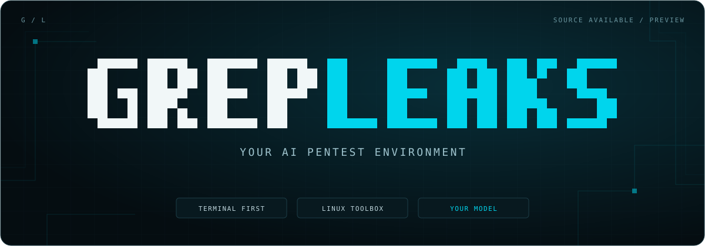

<p align="center">
  
</p>

<p align="center">
  <a href="https://github.com/grepleaks/grepleaks/actions/workflows/checks.yml"></a>
  <a href="https://github.com/grepleaks/grepleaks/releases/latest"></a>
  <a href="https://github.com/grepleaks/grepleaks/stargazers"></a>
  <a href="LICENSE"></a>
</p>

<p align="center">
  <strong>An AI pentest agent that lives in your terminal.</strong><br />
  Bring your model. Describe your task. Work with a Linux toolbox.
</p>

<p align="center">
  <a href="#get-started">Get started</a> ·
  <a href="#your-first-engagement">First engagement</a> ·
  <a href="#working-with-your-host">Host access</a> ·
  <a href="#documentation">Documentation</a> ·
  <a href="CONTRIBUTING.md">Contribute</a>
</p>

---

Grepleaks brings a conversational agent, a searchable **Pentest Tools** catalog
and a Debian-based Linux toolbox into one terminal interface. Ask it to investigate,
review its proposed actions, and inspect the results as you work.

Built on an [OpenCode](https://github.com/anomalyco/opencode) fork and OpenTUI,
with a Grepleaks interface: white and cyan branding, an animated background,
interactive tool cards and pentest-oriented prompt suggestions.

> [!NOTE]
> **Early preview.** The complete Docker workflow has been tested on macOS with
> Colima; component tests also pass under Linux. Launchers are provided for macOS,
> Windows and Linux, but full host pairing on native Windows/Linux still needs
> validation.

## Inside Grepleaks

| | What you get |
| :--- | :--- |
| **A terminal workspace** | Chat, tool output and a browsable catalog in a TUI built for security work. |
| **Pentest Tools** | Search the catalog and open tool descriptions before deciding what to use. A catalog entry does not mean the tool is installed. |
| **Tools on demand** | A core toolkit comes with the image. The agent can install additional compatible tools inside the container when needed. |
| **Your model provider** | Connect an OpenAI-compatible API using your own endpoint, model ID and key. |
| **Actions you can review** | The default policy asks for permission for actions such as command execution; some operations, including reading files, are allowed. |
| **A built-in host companion** | Request commands on your actual Mac, Windows or Linux machine when the task needs access beyond the container. |

## Get started

### 1. Check the prerequisites

You need:

- **Docker**, running and configured for Linux containers. On macOS, Docker Desktop
  or Colima can provide it; Windows uses Docker Desktop; Linux can use Docker Engine.
- **Python 3.10+** on your machine. No extra Python packages are required.
- An **OpenAI-compatible model API**: its base URL, model ID and API key.
- Internet access and enough free space for the Docker image and its dependencies.
  The first build downloads a substantial amount of software.

Clone this repository, or grab the sources as an archive:

```bash
git clone https://github.com/grepleaks/grepleaks.git
cd grepleaks
```

Prefer a download? Use **[Download ZIP](https://github.com/grepleaks/grepleaks/archive/refs/heads/main.zip)**
or pick a tagged archive on the [releases page](https://github.com/grepleaks/grepleaks/releases).
Then open a terminal in the folder containing this README.

### 2. Install once

The installer builds the Docker image and adds **`grepleaks`** to your user PATH.
It requires no administrator access and installs no extra Python packages.

**macOS / Linux**

```bash
python3 scripts/install.py --source . && export PATH="$HOME/.local/bin:$PATH"
```

<details>
<summary><strong>Windows — PowerShell</strong></summary>

```powershell
powershell -ExecutionPolicy Bypass -File .\install.ps1
$env:Path = "$env:LOCALAPPDATA\Grepleaks\bin;$env:Path"
```

Make sure `py -3 --version` reports Python 3.10 or newer. For native Windows host
commands, use this launcher from PowerShell or cmd. Starting the companion from
WSL makes WSL its host environment.

</details>

### 3. Launch from any folder

```bash
grepleaks
```

Use `grepleaks --workspace /path/to/engagement` to keep engagement files in a host
folder. The host companion starts automatically; use `--no-host-bridge` for container-only operation.
After installation, you can remove the downloaded repository. The installer keeps
only the host launcher and license notices; the engine lives in the Docker image.

On first launch, the TUI opens **Models**:

- **Grepleaks AI** — configure your Grepleaks API key and gateway URL.
- **+ Add model** — connect your own OpenAI-compatible provider.

Enter the provider's API base URL, exact model ID and API key directly in the TUI.
Key input is hidden. Connections and your selected model are saved in your private
`~/.grepleaks/state` directory, outside the project. Use **`/models`** to switch
between your saved models; the public provider catalog is not shown.

**Next time, just run `grepleaks`.** Keep Docker running. To update, run the
installer again with the new release's sources. Starting a conversation does not
require a build. Source development with `--dev` uses `./grepleaks` in a checkout.

<details>
<summary><strong>Already have your provider settings in environment variables?</strong></summary>

| Variable | Value |
| :--- | :--- |
| `BYOK_BASE_URL` | Your provider's API base URL, including its API path if required. |
| `BYOK_MODEL` | The exact model ID exposed by that provider. |
| `BYOK_API_KEY` | Your API key. |
| `BYOK_PROVIDER_NAME` | Optional display name. |

Set these in the shell that launches Grepleaks, or supply them through your secret
manager. Automated runs must supply configuration through the environment.
The launcher does not automatically load `.env` files.

See [INSTALL.md](INSTALL.md) for PowerShell examples, advanced configuration and
optional gateway settings. This repository does not require a hosted Grepleaks
service or provide a prebuilt public image.

</details>

## Your first engagement

Put the files you want the agent to work with inside `engagements/`. They appear
inside the container at `/engagement`.

Start with a `scope.md` describing the systems you are authorized to test, the
allowed activities, exclusions and any rate limits. Then try:

```text
Read /engagement/scope.md and propose a reconnaissance plan.
List the tools you would use and wait for my approval before running commands.
```

Other starting points:

```text
Review the API specification in /engagement for authentication and authorization risks.
```

```text
Analyze the scan results in /engagement and write a report with evidence and next steps.
```

Browse **Pentest Tools** to understand the available options. The agent can use
included tools or install additional compatible ones as the task requires.
Ask it to save the output you want to keep under `/engagement`.

> [!IMPORTANT]
> **The mounted workspace persists; the container is disposable.** Files saved
> under `/engagement` remain in your local `engagements/` folder. Conversation
> history, model settings and credentials persist in `~/.grepleaks/state`.
> Extra tool installations remain disposable. Without `--workspace`, files saved
> in `/engagement` disappear when the container stops.

## Working with your host

Choose the access the task actually needs:

| Option | What it makes available |
| :--- | :--- |
| `--no-host-bridge` | Container execution only, with private persistent state; no host commands. |
| `--workspace PATH` | One existing host folder, mounted **read-write** at `/engagement`. |
| `--host-access` | Your home directory, mounted **read-write** at `/host`. Set `GREPLEAKS_HOST_ROOT` to choose another folder. |
| Default (`--no-host-bridge` to disable) | The companion, which can execute commands on the real host with your user privileges. |

For a workspace plus the companion:

```bash
./grepleaks --workspace "$PWD/engagements"
```

On Windows:

```powershell
.\grepleaks.cmd --workspace "$PWD\engagements"
```

The companion starts and pairs automatically for that session. No second terminal
or manual token exchange is needed. The agent gets `host_info` to identify the host
and `host_run` to request host commands through the permission flow.

Host commands run **outside Docker**. Permission prompts are application controls,
not a host sandbox: a compromised container with access to the pairing credential
can use the connection. Enable it only for workflows and plugins you trust.
Likewise, files in read-write mounts can be changed or deleted by container commands.

On macOS and Windows, Docker still runs Linux in a VM. A broad mount does not turn
it into the host OS or automatically grant access to host hardware, processes or
Wi-Fi monitor mode.

Read [Host access](docs/HOST_ACCESS.md) and
[Host companion](docs/HOST_COMPANION.md) for the capabilities and boundaries.

## Verify your setup

After building, you can exercise the launcher without a real provider key or a
paid model request:

```bash
python3 scripts/smoke-container.py
```

On Windows, use `py -3 scripts/smoke-container.py`.

The test starts a local model stub and checks Docker startup, API authentication,
streaming, the host permission gate and a harmless host command. It verifies that
its marker file is absent before approval, approves that test command, then removes
its temporary workspace and container.

## Develop without rebuilding every edit

```bash
./grepleaks --dev --workspace "$PWD/engagements"
```

This mounts local engine source files read-only into the image. Quit and relaunch
after editing them. Changes to dependencies, the Dockerfile or files outside those
source mounts require a rebuild. Windows supports the same flags via `grepleaks.cmd`.

See [CONTRIBUTING.md](CONTRIBUTING.md) for tests and engine development conventions.

## Troubleshooting

| What you see | What to check |
| :--- | :--- |
| Docker is unavailable | Start your Docker runtime and check `docker version`. |
| Missing provider configuration | Launch from an interactive terminal, or set the three `BYOK_*` variables above. |
| Provider rejects the request | Check the API base URL, model ID, key and the provider's tool-calling support. |
| Workspace mount is rejected | The directory must exist and be shared with Docker. |
| A host service is unreachable | Container `localhost` refers to the container. Use `host.docker.internal` and check the service's bind address. |
| `EIO` or “no space left” during a build | Check free space on both the host and Docker VM, plus `docker system df`. |

More detail, including authenticated headless API mode: [INSTALL.md](INSTALL.md).

## Documentation

| Guide | Read it for |
| :--- | :--- |
| [Installation](INSTALL.md) | Provider configuration, headless commands and troubleshooting. |
| [Host access](docs/HOST_ACCESS.md) | Workspace sharing, host mounts and VM limits. |
| [Host companion](docs/HOST_COMPANION.md) | Native host commands, pairing and the trust model. |
| [Security](SECURITY.md) | Data exposure, permissions and vulnerability reporting. |
| [Contributing](CONTRIBUTING.md) | Local development, tests and contribution conventions. |
| [Licensing](docs/LICENSING.md) | Permitted professional use, sharing and the no-resale restriction. |

Use Grepleaks only on systems you own or are authorized to test. Your selected
model provider may receive prompts, file contents and tool output. Review its
handling of data before working with sensitive material.

## License and attribution

**Free to use for your work. Not for resale as a software product.**

Original Grepleaks contributions use the
[Grepleaks Source Available License 1.0](LICENSE):

- Use Grepleaks for personal projects, internal business work and **paid pentests**.
- Modify it and share free copies or forks with the applicable notices and terms.
- Do not sell Grepleaks, a modified or rebranded version, or paid access to it as
  a hosted software product without separate written permission.

You can charge for professional work and its reports; that does not grant the
right to sell the software itself. See [Licensing](docs/LICENSING.md) for examples
and the full license for the binding terms.

Grepleaks is **source available**, built on an OpenCode fork and OpenTUI. Inherited
MIT code and bundled Apache-2.0 skills retain their licenses; these restrictions
apply only to original Grepleaks material. See
[third-party notices](THIRD_PARTY_NOTICES.md).

Internal `@opencode-ai/*` package names, schemas and `OPENCODE_*` compatibility
settings remain intentional. The supported distribution is this terminal/container
product. Other retained upstream products are excluded from its installation
workspace graph and image, and require their own validation before use.

---

<p align="center">
  <strong>GREPLEAKS</strong><br />
  <sub>Your AI pentest environment.</sub>
</p>
